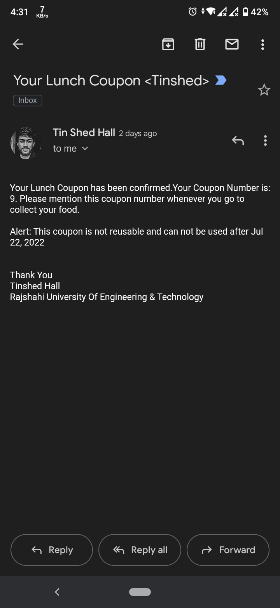

# Hall Food Coupon Booking System – Java Swing Desktop Application
**Java, Swing GUI, JavaMail API, File-Based Database, NetBeans**

– Developed a multi-hall food coupon management system for Rajshahi University of Engineering & Technology (RUET) with separate lunch and dinner slot management.
– Implemented real-time coupon availability tracking, booking confirmation with automated email notifications to customers using JavaMail API.
– Built intuitive GUI interfaces for 6 different hall managers (Bongobondhu, Hamid, Shohidul Islam, Tinshed, Zia) with form validation and user-friendly navigation.
– Engineered persistent data storage using file-based system to track booked/available coupons, ensuring data integrity across multiple concurrent bookings.
– Integrated real-time clock and date display, order management, and comprehensive booking history for audit trails.

 

 
 

 
 

 
 

 
 

 
 

 
 

 
 
### `Booking confirmation Email to customers:`

 
 
### `Those who are booked their coupon:`

